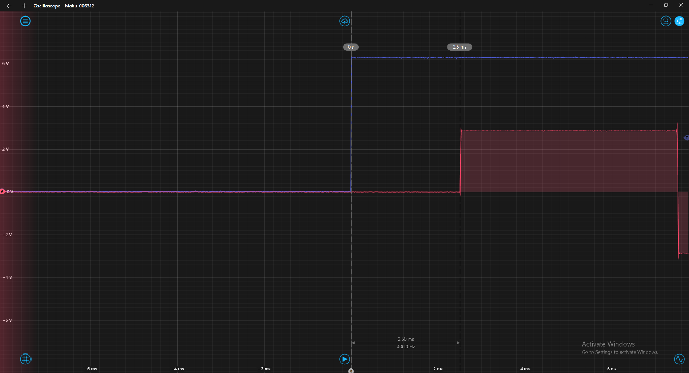

# Latency Measurements Protocol
This protocol consists on sending a digital pulse to trigger a square wave. This digital pulse is sent from the Soundcard's OUT0 pin to the IN0. Then, when the computer receives the information that the IN0 switched from LOW to HIGH, it tells the soundcard to start playing the sound in index 2. So, the latency measured with this protocol takes into account the two-way data streaming via USB.

For this protocol, a Harp SoundCard is used and it is assumed that both the USB drivers and the board's firmware are already installed. If these are not installed, follow the instructions in the [device's repository](https://github.com/harp-tech/device.soundcard).

## Protocol
1. Download [this Bonsai environment](https://github.com/fchampalimaud/cdc-speaker-calibration/releases/download/0.2.0-alpha/LatencyMeasurements.zip) and extract it.
2. Open the Harp Sound Card GUI and load `square_wave.bin` (which is in the Bonsai environment's directory) to index 2.
3. Run `Bonsai.exe` and open the `latency.bonsai` workflow.
4. Connect the OUT0 and IN0 pins of the SoundCard.
5. Connect either the left or right audio channel from the Soundcard to one of the oscilloscope's input channels.
6. Connect OUT0 (and one of the Soundcard's ground pins) to another oscilloscope's input channel.
7. Start the Bonsai workflow and press `A` to send a 100 ms pulse from the OUT0 pin. This pulse will then trigger the signal.
8. Measure the delay between the start of the pulse and the start of the square wave. In the figure below, the measured latency is of 2.5 ms (the blue signal is the pulse and the red one is the square wave).

